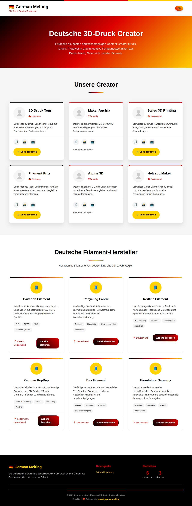

# js-web-germanmelting

A curated dataset of German, Austrian, and Swiss 3D printing content creators with a modern Svelte frontend showcase.

## 🎯 Features

- **Comprehensive Dataset**: Curated collection of 3D printing content creators from the DACH region
- **Svelte Frontend**: Modern, responsive showcase with German flag theming
- **Multilingual Support**: German/English language switching
- **Filament Vendors**: Directory of German filament manufacturers
- **Responsive Design**: Optimized for all devices
- **Static Site Generation**: Fast loading with SvelteKit static adapter

## 📸 Screenshots

### German Version


### English Version  


## 📊 Data Structure

The dataset is stored in `data/creators.json` and contains information about content creators focused on 3D printing from the DACH region (Germany, Austria, Switzerland).

### Schema

Each creator entry contains the following fields:

- `slug`: URL-friendly identifier based on the creator's name
- `name`: Display name of the content creator
- `description`: Brief description of the creator's content and focus
- `logoUrl`: URL to the creator's logo or profile image
- `profiles`: Object containing social media profile URLs
  - `tiktok`: TikTok profile URL
  - `instagram`: Instagram profile URL  
  - `youtube`: YouTube channel URL
- `shopUrl`: Optional URL to the creator's shop (null if not available)
- `country`: Creator's country (Germany, Austria, or Switzerland)

## 🖥️ Svelte Frontend Showcase

A beautiful Svelte frontend that showcases all creators with:

- German flag-themed design (black, red, gold colors)
- Responsive layout for all devices
- Creator cards with social media links and shop buttons
- German filament vendor directory
- Language switching between German and English
- Modern card-based UI with hover effects
- Static site generation for fast loading

### Key Features

- **German Theming**: German flag colors (black #000, red #DD0000, gold #FFCE00) used throughout
- **Responsive Design**: Mobile-first approach with grid layouts
- **Internationalization**: Full German/English support with svelte-i18n
- **Creator Showcase**: Individual cards with avatars, descriptions, social links
- **Filament Vendors**: Dedicated section for German filament manufacturers
- **Modern UI**: Card hover effects, gradients, and smooth transitions

### Running the Frontend

```bash
# Install frontend dependencies
npm run frontend:install

# Start development server
npm run frontend:dev

# Build for production
npm run frontend:build
```

Or navigate to the frontend directory:

```bash
cd frontend
npm install
npm run dev
```

## 🚀 Deployment

The frontend is automatically deployed to GitHub Pages using GitHub Actions. The workflow:

1. Builds the Svelte application
2. Generates static files using SvelteKit adapter-static
3. Deploys to GitHub Pages

### Live Demo

Visit the live demo at: `https://tscholze.github.io/js-web-germanmelting/`

## 📖 Usage

```javascript
// Load the dataset
const data = require('./data/creators.json');

// Access creators array
const creators = data.creators;

// Filter by country
const germanCreators = creators.filter(creator => creator.country === 'Germany');

// Find by slug
const creator = creators.find(c => c.slug === '3d-druck-tom');
```

## 🚀 Examples

Run the demo script to see the dataset in action:

```bash
node examples/demo.js
# or using npm
npm run demo
```

This will display all creators grouped by country, show statistics, and demonstrate how to search and filter the data.

You can also validate the JSON structure:

```bash
npm run validate
```

## 🤝 Contributing

To add new creators or update existing information, please ensure the JSON structure follows the established schema.

## 📁 Project Structure

```
js-web-germanmelting/
├── data/
│   └── creators.json          # Main dataset
├── examples/
│   └── demo.js               # Usage examples
├── frontend/                 # Svelte frontend
│   ├── src/
│   │   ├── lib/
│   │   │   ├── components/   # Svelte components
│   │   │   └── i18n.js      # Internationalization
│   │   └── routes/           # SvelteKit routes
│   ├── static/              # Static assets
│   └── build/               # Production build
├── docs/
│   └── screenshots/         # Frontend screenshots
├── .github/
│   └── workflows/
│       └── deploy.yml       # GitHub Pages deployment
└── package.json             # Project configuration
```

## 🛠️ Technology Stack

- **Frontend**: Svelte 5 + SvelteKit
- **Styling**: CSS with CSS Variables (German flag theming)
- **Internationalization**: svelte-i18n
- **Build**: Vite
- **Deployment**: GitHub Pages + GitHub Actions
- **Static Generation**: @sveltejs/adapter-static